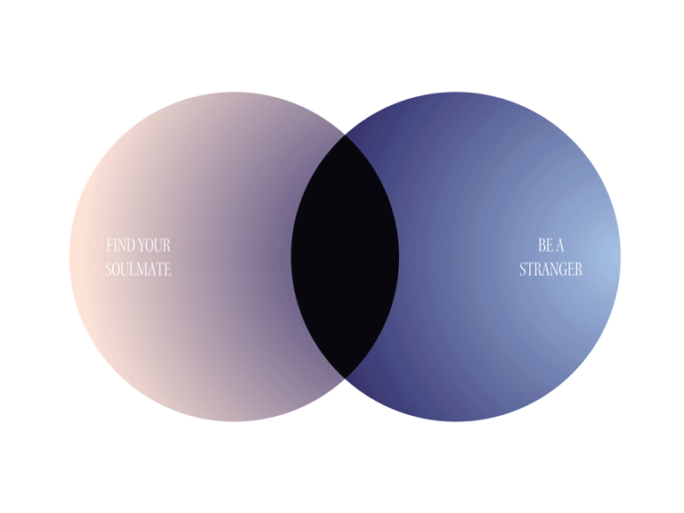
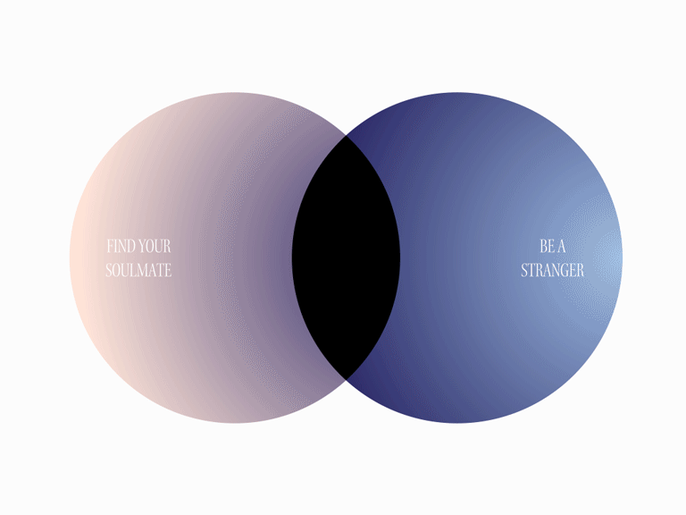
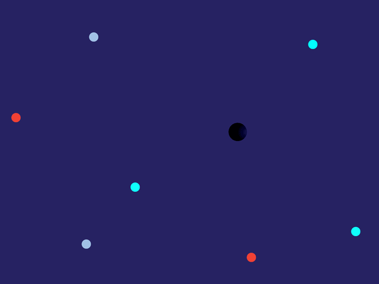

# soulmates + strangers

## conceptual web design, a visual walkthrough

 

<h3>"TELL US A SECRET"</h3>
 

when user enters, they will be prompted with the first interaction 

 

on type, user's words will appear at random within the ellipse (space keycode = word break)

string is logged on firebase as newPerson, along with their "secret" and "location" (not pictured)

 

on enter, words fade with starting ellipse and venn diagram appears with second prompt

 

user is presented with 2 options that lead to two different dynamic interfaces

 
 
<h3>OPTION 1 ————— "FIND YOUR SOULMATE"</h3>
 

if user chooses to "find your soulmate," the interface only shows other inputs that have >==2 of the same words (non-articles) in their "secret"

each shows up as a small pulsing dot, opacity 10%-100% based on how similar their inputs are (ie. a "secret" that is exactly the same as yours would be a 100% opacity dot)

user can click on the dots to view anonymous "secrets"

 
 
<h3>OPTION 2 ————— "BE A STRANGER"</h3>
 

if user chooses to "be a stranger," the interface only shows other inputs that have <==2 of the same words (non-articles) in their "secret"

each shows up as a random colored pulsing dot, located randomly on the DOM

user can click on the dots to view anonymous "secrets"

